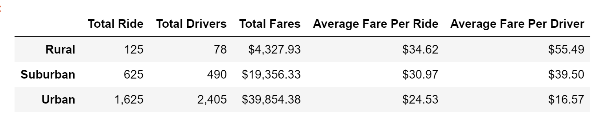

# PyBer_Analysis

# Overview of the analysis:

V. Isualize has given me and Omar a brand-new assignment. Using your Python skills and knowledge of Pandas, we created a summary DataFrame of the ride-sharing data by city type. Then, using Pandas and Matplotlib, we created a multiple-line graph that shows the total weekly fares for each city type. Finally, we will submit a written report that summarizes how the data differs by city type and how those differences can be used by decision-makers at PyBer.

# Results:
 

-	Urban cities have the highest number of rides and highest number of drivers.

-	Rural cities show the lowest number of rides and lowest number of drivers. 

-	Suburban cities come second in rides and number of drivers

-	Rural cities have the least number of drivers but have the highest average of fare per ride and fare per driver.

-	Urban cities have the most drivers but have the lowest average of fare per ride and fare per driver

-	During 2019 between January and April we analyzed for the total fare for each of the city type and we can quickly observe that Urban city types had the highest total fares for     all the weeks and rural areas had the least.

-	We can also observe that between February and March has the highest total fares for each of the city type showing increased demand at that time.

-	Urban cities seem to bring a lot of revenue in March. 

-	For Suburban city there is an increase in fares toward the end of April.

Summary
Three business recommendations: 

1)	More investments should be made toward Urban cities because they have the highest total fares and most amounts of rides accounting for the majority of the revenue.
2)	The business should focus more on the rural area as the market share is low while the margins are very high.
3)	For rural areas to place a a cap on fare to keep the service affordable. There could be areas that are underserved service and putting a cap would make it more accessible    while still allowing for profit.
